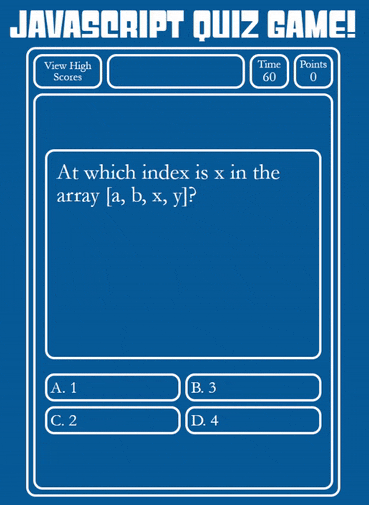

# Quiz Game

This is a quiz game designed to test multiple-choice answering skills against a time limit. Questions are selected randomly from a set of the selected category, and their answers are displayed in a random order to create a unique version of the quiz every time it is attempted.

On Easy mode, players are allowed two attempts per question, with reduced points awarded on the second attempt. If the question is answered correctly or both incorrect attempts are used, the time is paused and the correct answer is revealed in green. Additionally, the game message bar at the top displays points awarded for correct answers and time deducted for wrong answers.

After the quiz has concluded, either by all available questions being answered or the time being reduced to zero, a final score is calculated with a bonus for any remaining time, and the player is given the option of saving their score to the high score list. The high score list is ranked from high to low, and displays the initials of the player, difficulty, category, and final score.

### Difficulty Modes & Question Categories

This quiz game was also designed to allow for multiple question categories and multiple difficulty modes that can be switched between at the main menu.

### Customizability

The JavaScript code for this generator was written such that it can be easily modified for different requirements. The difficulty modes are stored in a single `mode` object with values for time limit, attempts allowed, time deductions, and final time bonus multiplier.

Similarly, the questions set is stored in `quiz-questions.js` that can be easily added to for additional categories or questions, with no further adjustments in the code required. As the first answer in each set is the correct answer, no additional parameters are required.

---

## Getting Started

These instructions will get you a copy of the project up and running on your local machine for development and testing purposes. See deployment for notes on how to deploy the project on a live system.

### Prerequisites

* IDE to view/edit source code (e.g. Visual Studio Code).

### Installing

1. Clone repository.
1. Make any desired changes to difficulty modes and/or question set `quiz-questions.js` in IDE.
1. Open [index.html](index.html) in web browser.

### Deployment

1. Upload index.html and assets folder to webhosting site, such as GitHub.
1. If using GitHub, deploy via GitHub Pages.

---

## Built With

* [JavaScript](https://developer.mozilla.org/en-US/docs/Web/JavaScript)
* [HTML](https://developer.mozilla.org/en-US/docs/Web/HTML)
* [CSS](https://developer.mozilla.org/en-US/docs/Web/CSS)
* [GitHub](https://github.com/)

## Deployed Page

* [See Live Site](https://starryblue7.github.io/quiz-game/)

## Author

Vince Lee
- [Portfolio](https://starryblue7.github.io/portfolio/)
- [Github](https://github.com/StarryBlue7)
- [LinkedIn](https://www.linkedin.com/in/vince-lee/)

## License

License: [MIT License](https://vince-lee.mit-license.org/)

## Acknowledgments

* Free licensed "Jeopardy" style font from [Typodermic Fonts](https://typodermicfonts.com/).
